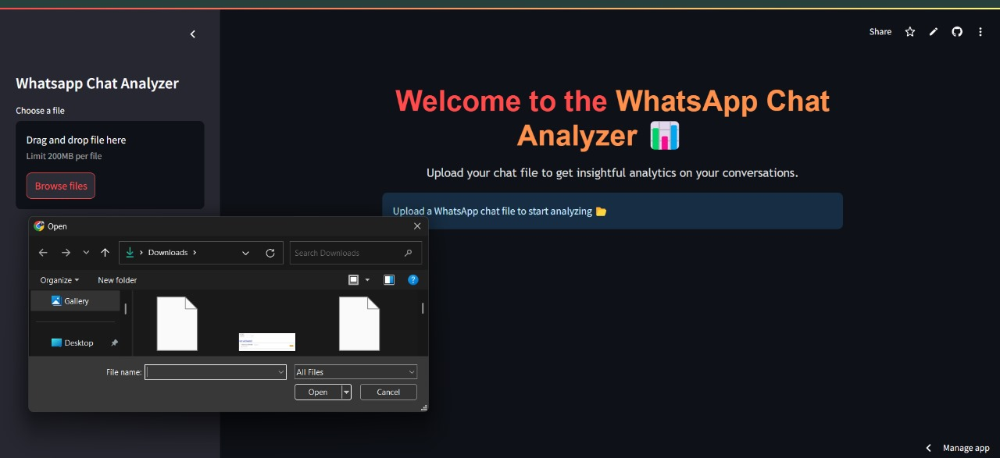
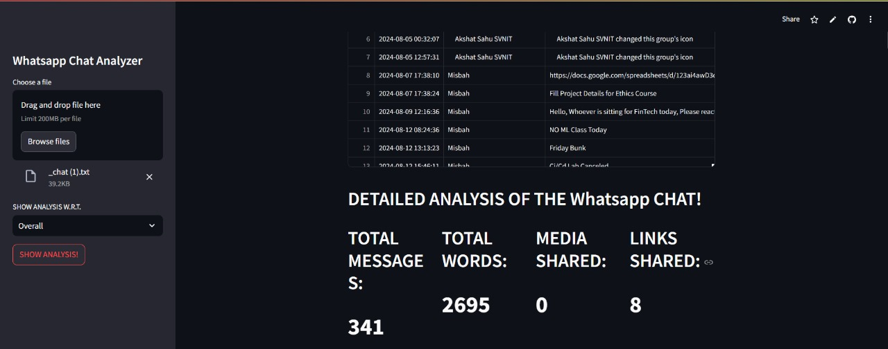
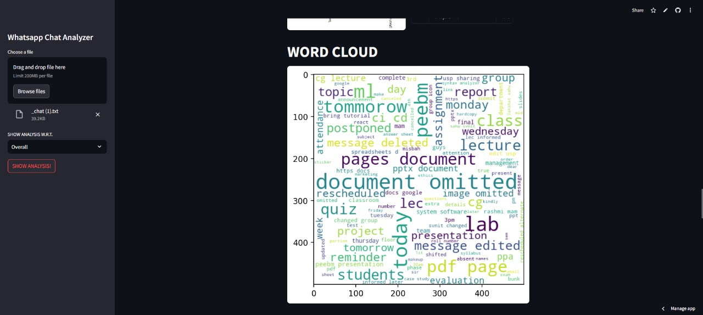
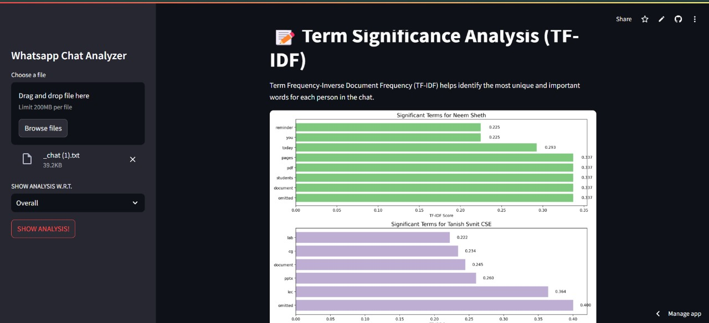
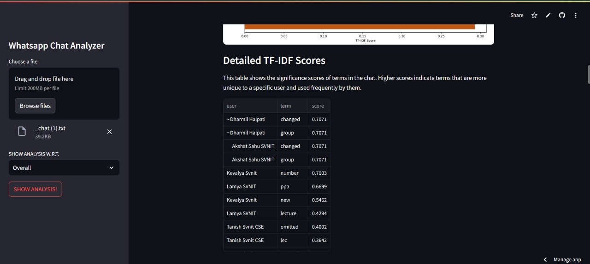
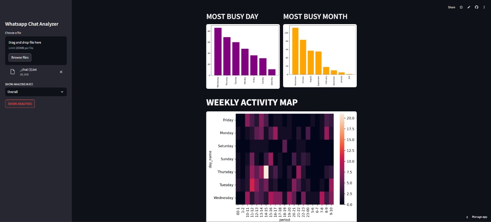
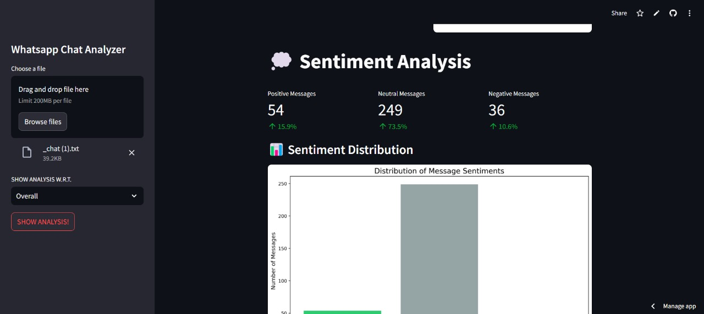
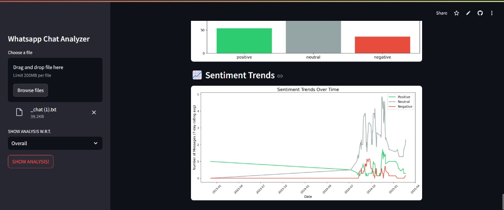
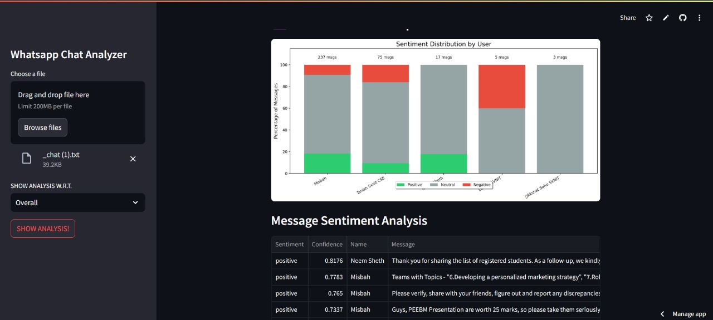

# retrace 
an analyzer for exported whatsapp chats — structure, sentiment, and stats.

built during a data science course.  
my part: ideation, system behavior, and sentiment analysis pipeline.

---

## features  
- parses raw chat logs (android & iphone)  
- visualizes message timelines, emoji stats, word clouds  
- tf-idf scoring per user  
- sentiment analysis using textblob + vader  
- supports both group-level and user-specific insights

---

## visual insights 📊  
snapshots from the streamlit-based chat analyzer ↓

  
  
  

  
  
  

  
  
  

---

## tech stack  
- python, streamlit  
- pandas, matplotlib, seaborn  
- nltk, textblob, vader, scikit-learn

---

## run it  
[› deployed app](https://chat-analysis-ds.streamlit.app/)  
[› project report](./chat-analyzer-report.pdf)

---

*some conversations end, others get analyzed.*
